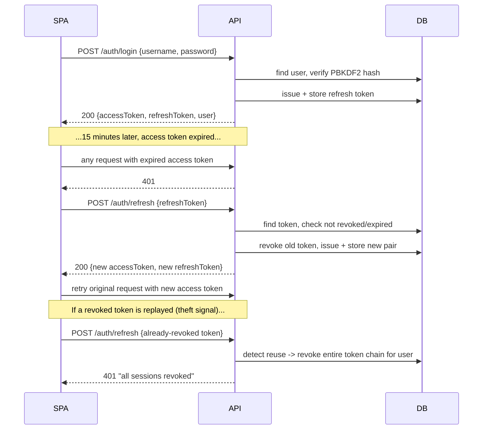

# API Reference

Base URL: `/api/v1`. Interactive docs (Development environment only) at
`/scalar/v1`; raw OpenAPI document at `/openapi/v1.json`.

All endpoints except `POST /auth/login` and `POST /auth/refresh` require an
`Authorization: Bearer <accessToken>` header. Endpoints marked **Admin** additionally
require the `Admin` role claim.

## Auth flow (login + refresh rotation)



## Endpoints

### Auth
| Method | Path | Auth | Description |
|---|---|---|---|
| POST | `/auth/login` | none | Returns access + refresh token pair |
| POST | `/auth/refresh` | none (refresh token in body) | Rotates the refresh token, returns a new pair |
| POST | `/auth/logout` | Bearer | Revokes the given refresh token |

### Users (Admin only)
| Method | Path | Description |
|---|---|---|
| GET | `/users?search=&roleId=&isActive=&pageNumber=&pageSize=` | Paginated list |
| GET | `/users/{id}` | Get one |
| POST | `/users` | Create |
| PUT | `/users/{id}` | Update profile/role |
| PATCH | `/users/{id}/status` | Activate/deactivate |

### Roles (Admin only)
| Method | Path | Description |
|---|---|---|
| GET | `/roles` | List all |
| POST | `/roles` | Create custom role |
| PUT | `/roles/{id}` | Update (system roles rejected with 409) |

### Stations
| Method | Path | Auth | Description |
|---|---|---|---|
| GET | `/stations?search=&isActive=&pageNumber=&pageSize=` | any authenticated | Paginated list |
| GET | `/stations/{id}` | any authenticated | Get one |
| POST | `/stations` | Admin | Create |
| PUT | `/stations/{id}` | Admin | Update |
| PATCH | `/stations/{id}/status` | Admin | Activate/deactivate |

### Routes
| Method | Path | Auth | Description |
|---|---|---|---|
| GET | `/routes?search=&originStationId=&destinationStationId=&isActive=&pageNumber=&pageSize=` | any authenticated | Paginated list |
| GET | `/routes/{id}` | any authenticated | Get one |
| POST | `/routes` | Admin | Create (409 if origin/destination pair already exists) |
| PUT | `/routes/{id}` | Admin | Update |
| PATCH | `/routes/{id}/status` | Admin | Activate/deactivate |

### Buses
| Method | Path | Auth | Description |
|---|---|---|---|
| GET | `/buses?search=&isActive=&pageNumber=&pageSize=` | any authenticated | Paginated list |
| GET | `/buses/{id}` | any authenticated | Get one |
| POST | `/buses` | Admin | Create + auto-generate seat layout |
| PUT | `/buses/{id}` | Admin | Update number/operator |
| PATCH | `/buses/{id}/status` | Admin | Activate/deactivate |
| GET | `/buses/{busId}/seat-layout` | any authenticated | Full seat map |
| PATCH | `/buses/{busId}/seat-layout/seats/{seatId}/status` | Admin | In-service / out-of-service |
| PATCH | `/buses/{busId}/seat-layout/seats/{seatId}/class` | Admin | Reclassify seat |

### Schedules
| Method | Path | Auth | Description |
|---|---|---|---|
| GET | `/schedules?busId=&routeId=&status=&pageNumber=&pageSize=` | any authenticated | Paginated list |
| GET | `/schedules/trips?travelDate=&routeId=` | any authenticated | Resolved concrete trips for a date |
| GET | `/schedules/{id}` | any authenticated | Get one |
| POST | `/schedules` | Admin | Create (409 on bus/time overlap) |
| PUT | `/schedules/{id}` | Admin | Update timing/fare/recurrence |
| PATCH | `/schedules/{id}/status` | Admin | Cancel/reactivate |

## Error shape

All errors are RFC 7807 `application/problem+json`:

```json
{
  "type": "https://httpstatuses.io/409",
  "title": "A route between these two stations already exists.",
  "status": 409,
  "detail": "A route between these two stations already exists.",
  "instance": "/api/v1/routes"
}
```

Validation failures additionally include an `errors` object keyed by property name,
in the same shape ASP.NET Core's built-in `ValidationProblem()` produces.

## Sample requests

See [`sample-requests.http`](sample-requests.http) — importable directly in VS Code
(REST Client extension), JetBrains Rider/IntelliJ, or convertible to a Postman
collection via `openapi/v1.json`.
