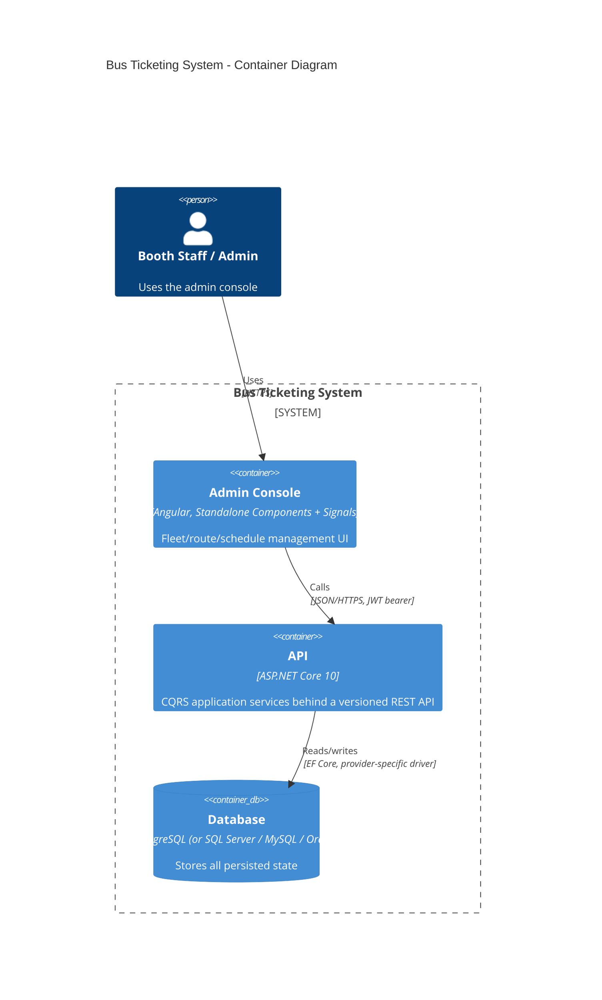
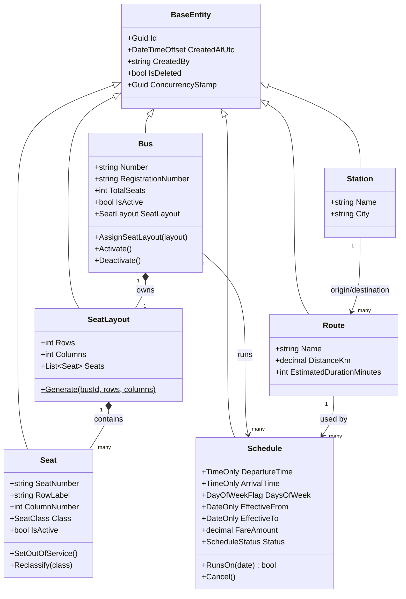
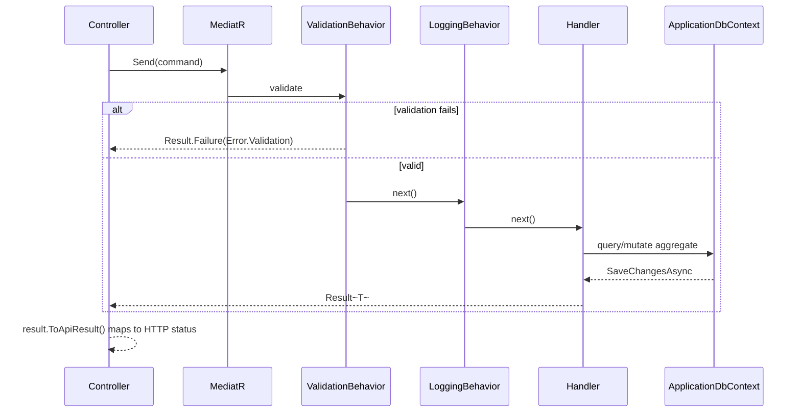

# Architecture

## Layering

Clean Architecture with vertical-slice organization inside the Application layer:

```
Domain            <- no dependencies on anything
  ^
Application       <- depends only on Domain
  ^
Infrastructure    <- depends on Application (implements its interfaces) + Domain
  ^
Presentation      <- depends on Application + Infrastructure (composition root only)
```

The dependency rule is enforced structurally, not just by convention:
`BusTicketing.Domain.csproj` references nothing but `MediatR.Contracts` (for the
`IDomainEvent` marker interface); `BusTicketing.Application.csproj` references only
`BusTicketing.Domain`; `BusTicketing.Infrastructure.csproj` references only
`BusTicketing.Application`. There is no path by which Infrastructure or Presentation
concerns (EF Core types, HTTP types) can leak into Domain or Application code.

## Container diagram



## Class diagram (core Fleet/Schedule aggregates)



## CQRS request flow

Every write goes through the same pipeline regardless of module:



## Key design decisions and their tradeoffs

| Decision | Why | Tradeoff accepted |
|---|---|---|
| `IApplicationDbContext` exposing `DbSet<T>` directly, no generic `IRepository<T>` | CQRS handlers already express intent through their command/query name; wrapping each `DbSet` in an identical `Repository<T>.GetByIdAsync/AddAsync/...` adds a layer that forwards to EF Core without changing behavior (the same pattern used in Jason Taylor's reference Clean Architecture template). `IApplicationDbContext` **is** the repository abstraction — it is what makes the Application layer swappable off EF Core, not a second wrapper around it. | Handlers see EF Core's `IQueryable`, so a careless handler could leak provider-specific query shapes. Mitigated by keeping all query composition inside the handler (never in the controller) and by the DB provider abstraction meaning no handler can reference provider-specific SQL. |
| `Guid ConcurrencyStamp` column instead of native rowversion/xmin | The brief requires switching between PostgreSQL, SQL Server, MySQL and Oracle by configuration alone. Native optimistic-concurrency columns are not portable: Postgres uses `xmin` (system column, not user-settable), SQL Server uses `rowversion`/`timestamp` (auto-incrementing binary(8)), MySQL/Oracle have no equivalent built-in. A plain Guid column compared by value via `.IsConcurrencyToken()` behaves identically on all four. | One extra write per row update to regenerate the stamp (negligible), and it's a deliberate app-level convention rather than a database-enforced guarantee — acceptable since EF Core still throws `DbUpdateConcurrencyException` on a stale value exactly as it would with a native token. |
| `Schedule` as a recurring template, not per-date rows | Matches the reference brief exactly ("System automatically creates daily trips... one trip per route at 7:00 AM") while avoiding pre-generating rows for every future date. | Trip resolution (`GetTripsForDateQuery`) does the `RunsOn(date)` filter in memory after a DB round-trip, rather than as a single SQL predicate — acceptable at this data volume (tens of schedules), documented as a scaling concern in ROADMAP.md for when per-date "Trip" rows will be needed anyway (to hold booked-seat state). |
| Migrations are per-provider, not shared | EF Core migrations bake in provider-specific SQL (column types, identity syntax). A single migration set cannot apply cleanly across Postgres/SQL Server/MySQL/Oracle. | Switching the active provider requires regenerating (or maintaining) a migrations folder per provider — documented explicitly in DATABASE.md rather than glossed over. |
| Audit trail as its own `AuditLog` table, separate from Serilog | Serilog's request logs are operational (may be pruned, unstructured for business queries). `AuditLog` is a first-class, queryable, permanent record of *who did what to which entity*, matching the brief's audit-logging requirement precisely. | A second write path to keep in sync; mitigated by writing audit entries inside the same `SaveChangesAsync` unit of work as the business change, so they can never diverge. |
| Password hashing via PBKDF2-HMACSHA256 (built into .NET), not BCrypt/Argon2 | Zero extra native dependency, NIST SP 800-132 compliant, tunable iteration count stored alongside the hash for future upgrades. | Argon2id is the stronger modern default for new systems with no legacy constraint; noted as a candidate upgrade in SECURITY.md. |

## Deployment diagram

See [DEPLOYMENT.md](DEPLOYMENT.md) for the full deployment diagram and environment
configuration reference.
