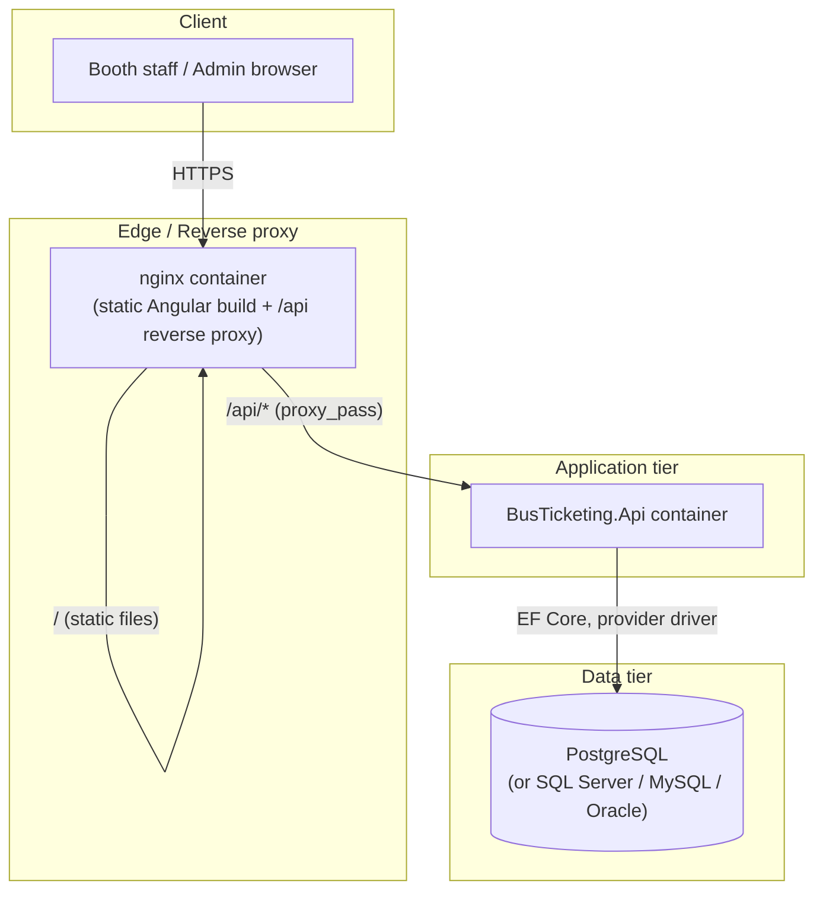

# Deployment

## Deployment diagram

In `docker-compose.yml` this maps directly to the `frontend`, `api`, and `postgres`
services on a shared Docker network — `nginx.conf`'s `proxy_pass http://api:8080/api/`
resolves `api` via Docker Compose's built-in DNS.

## Environment configuration

All configuration is environment-variable driven in containers (ASP.NET Core's
double-underscore convention maps `Jwt__Secret` to `Jwt:Secret`, etc.):

| Variable | Required | Notes |
|---|---|---|
| `ASPNETCORE_ENVIRONMENT` | yes | `Production` disables Scalar/OpenAPI and enables HTTPS redirection |
| `Database__Provider` | yes | `PostgreSql` \| `SqlServer` \| `MySql` \| `Oracle` |
| `ConnectionStrings__Default` | yes | Provider-specific connection string |
| `Jwt__Secret` | yes | **Must** be a high-entropy secret ≥32 chars; `docker-compose.yml` fails fast via `${JWT_SECRET:?...}` if unset |
| `Jwt__Issuer` / `Jwt__Audience` | yes | Must match between token issuance and validation |
| `Cors__AllowedOrigins__0..n` | yes if API and SPA are cross-origin | Not needed when nginx reverse-proxies same-origin (the default compose setup) |
| `SeedData__Enabled` | no (default `true`) | Set `false` in any shared/production environment — seeding creates the well-known demo accounts |

## Production checklist

- [ ] `Jwt__Secret` is a freshly generated, high-entropy value stored in a secrets
      manager (Azure Key Vault, AWS Secrets Manager, Docker/Kubernetes secrets) — never
      in `appsettings.json` or an env file committed to source control.
- [ ] `SeedData__Enabled=false`, and the seeded `admin`/`dhaka_staff_1`/`ctg_staff_1`
      accounts are either removed or had their passwords rotated first.
- [ ] `ASPNETCORE_ENVIRONMENT=Production` (disables Scalar UI and raw exception detail
      in error responses — see the `_environment.IsDevelopment()` check in
      `GlobalExceptionMiddleware`).
- [ ] TLS terminated at the edge (nginx/load balancer) with a real certificate;
      `UseHttpsRedirection()` is already active outside Development.
- [ ] `Cors__AllowedOrigins` restricted to the real frontend origin(s) if not using the
      same-origin nginx proxy setup.
- [ ] Database backups configured — this project does not manage backup schedules;
      that's an infrastructure/ops responsibility per your chosen provider.
- [ ] Log retention reviewed: `Serilog` file sink rolls daily with a 30-file retention
      limit by default (`Program.cs`) — adjust for your compliance requirements.
- [ ] Health check endpoints (`/health/live`, `/health/ready`) wired into your
      orchestrator's liveness/readiness probes.

## Scaling notes

The API is stateless (JWT bearer auth, no server-side session), so horizontal scaling
behind a load balancer requires no sticky sessions. The one shared-state concern is
refresh token rotation racing across replicas under extremely high concurrent refresh
volume from the same user — acceptable at MVP scale; a distributed lock would be the
next step if that ever becomes a measured bottleneck.
