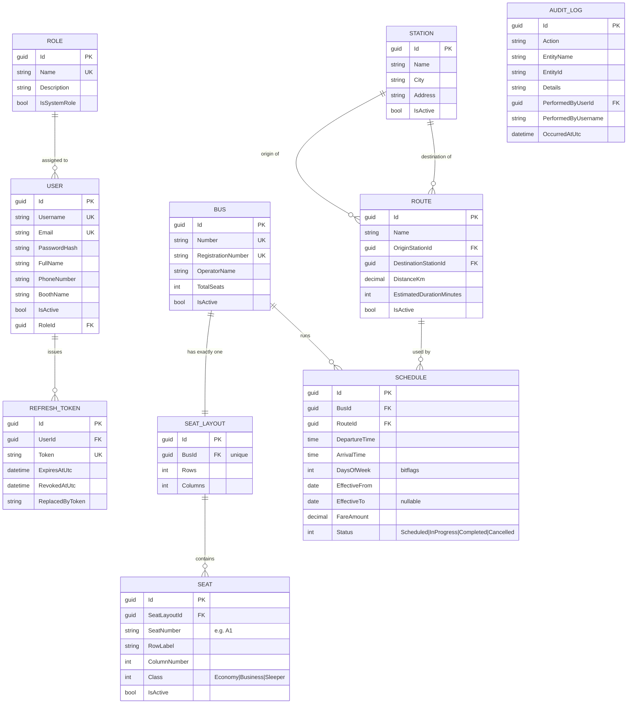

# Entity Relationship Diagram

## Notes

- **Every table** additionally carries the `BaseEntity` audit columns:
  `CreatedAtUtc`, `CreatedBy`, `ModifiedAtUtc`, `ModifiedBy`, `IsDeleted`,
  `DeletedAtUtc`, `DeletedBy`, `ConcurrencyStamp`. These are omitted above for
  readability — see [DATABASE.md](DATABASE.md) for the full column list.
- **`Bus` ↔ `SeatLayout`** is a strict 1:1 — enforced by a unique index on
  `SeatLayout.BusId` — because a bus is never usable without exactly one seat map.
- **`Schedule`** is a *recurring trip template*, not a per-date row. A concrete
  trip on a specific calendar date is resolved at query time by intersecting
  `DaysOfWeek`/`EffectiveFrom`/`EffectiveTo` against the requested date
  (`Schedule.RunsOn(date)` in the domain layer). This avoids pre-materializing rows
  for every bus/day/year combination — see ARCHITECTURE.md for the tradeoff.
- **`AuditLog`** has no FK constraint enforced on `PerformedByUserId` on purpose:
  audit history must survive a user being deleted.
- Booking/Ticket/Payment tables are intentionally absent from this phase — see
  [ROADMAP.md](ROADMAP.md) for the planned schema addition.
