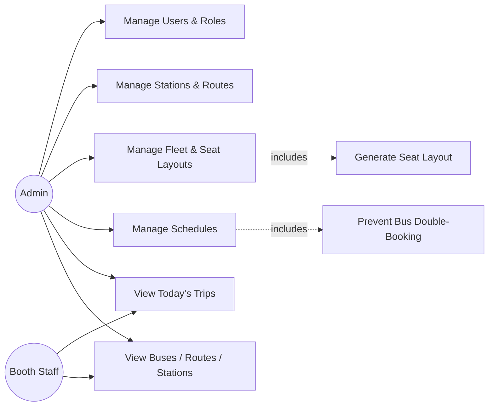

# Roadmap

## Phase 1 (this delivery): Foundation + Fleet Operations

Auth, Users, Roles, Stations, Routes, Buses, Seat Layouts, Schedules — fully
implemented backend-to-frontend, with tests. See [FEATURES.md](FEATURES.md) for the
line-by-line checklist against the original brief.

## Use case diagram — current scope

## Activity diagram — creating a bus (illustrates the transactional seat-layout generation)

## Phase 2 (next): Booking, Mock Payment, Dashboard

Not started — building a client booking portal or a real dashboard against these
before the data model exists would produce non-functional scaffolding, so they were
deliberately deferred rather than half-built. Planned shape:

### New domain concepts
- **Trip**: a concrete, bookable instance of a `Schedule` on a specific `TravelDate`
  (materializing what `GetTripsForDateQuery` currently computes on the fly, because
  booking needs a stable row to hold per-seat sold/held state).
- **Ticket**: links a `Trip`, a `Seat`, and passenger details; unique constraint on
  `(TripId, SeatId)` as the DB-level double-booking backstop, with the same
  application-level pre-check + `Error.Conflict` → HTTP 409 pattern already used by
  `CreateScheduleCommandHandler` for bus/time overlap.
- **Payment**: mock gateway — records an `Intent`/`Captured`/`Failed` state machine
  against a `Ticket`, no real payment processor integration (matches the brief's
  "Mock Payment" module).

### New capabilities
- Ticket booth workflow: search trips → seat map (live availability, not just the
  static layout this phase shows) → passenger info → confirm → print ticket, mirroring
  the reference brief's screens 5–6 exactly.
- Ticket cancellation (frees the seat, records a reason) — same shape as the
  reference brief's section 7.
- A real Dashboard module: today's sold/available seat counts, revenue, route-wise
  and booth-wise breakdowns — currently the Angular dashboard only shows what the
  Phase 1 backend can honestly support (trip listing, fleet/route/station counts);
  it does not fabricate booking numbers that don't exist yet.
- A public-facing client booking portal, gated on the httpOnly-cookie token migration
  described in SECURITY.md, since a customer-facing surface has a materially larger
  attack surface than an internal booth-staff tool.

### Hardening carried into Phase 2
- Rate limiting on auth endpoints (SECURITY.md).
- Fine-grained permission claims per role, not just role-name checks.
- Per-provider migration folders actually generated and tested against all four
  database engines (DATABASE.md currently documents the *process*; Phase 2 is where
  it gets exercised against SQL Server/MySQL/Oracle, not just PostgreSQL).
