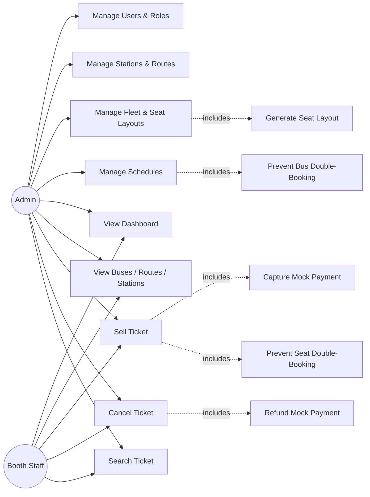

# Roadmap

## Phase 1: Foundation + Fleet Operations — ✅ delivered

Auth, Users, Roles, Stations, Routes, Buses, Seat Layouts, Schedules — fully
implemented backend-to-frontend, with tests.

## Phase 2: Booking, Mock Payment, Real Dashboard — ✅ delivered

Ticket sell/cancel/search, mock payment capture, double-booking prevention
(application pre-check + DB unique-index backstop), and a Dashboard driven by real
sold/available/revenue data. See [FEATURES.md](FEATURES.md) for the line-by-line
checklist and `git log` for the exact commits.

## Use case diagram — current scope (Phase 1 + 2)

## Activity diagram — creating a bus (illustrates the transactional seat-layout generation)

## Phase 3: Client-facing portal — ✅ delivered

Separate Angular client portal for public trip search and booking, running
parallel to the admin console. See `frontend/bus-ticketing-client/` for the
full implementation.

### Hardening
- Rate limiting on `/auth/login` (SECURITY.md).
- Fine-grained permission claims per role, not just role-name checks.
- Per-provider migrations actually generated and tested against SQL
  Server/MySQL/Oracle, not just PostgreSQL (DATABASE.md documents the process;
  it hasn't been exercised against all four engines).
- Ticket-number generation moved from a COUNT-based query to a DB sequence per
  date, closing the narrow race condition documented in `SellTicket.cs`.
- Standard security headers (HSTS, X-Content-Type-Options, etc.) explicitly configured.

## Phase 4: Production hardening + SQA enablement — ✅ delivered

Database artifacts, release tracking, configurable real-bus seat layout, Postman collection, and enterprise-grade developer documentation. See `release/new-release.md` for the line-by-line feature checklist and `git log` for the exact commits.

### Database artifacts
- Versioned SQL in `database/` (schema, stored procedures, functions, views, triggers, seed data)
- Monthly versioning under `database/2026/august/`
- Standardized header block on every artifact: creation date, modified date, reason, developer, context, API/cron/service, DB provider

### Release tracking
- `GET /api/v1/release/current` — public endpoint for SQA to see what was built and bugs resolved
- `GET /api/v1/release/notes` — raw markdown of release notes
- `release/new-release.md` — single source of truth

### Configurable real-bus seat layout
- Backend: `SeatLayout.LayoutType` (`StandardGrid` | `RealBus`) + `LayoutConfigJson`
- Admin: bus creation form exposes layout type, driver seat toggle, aisle gap, and per-row left/right seat counts
- Frontend client: real-bus-shaped seat grid with driver seat, aisle gap, and configurable left/right groups
- Backend `GetAvailableSeatsQueryHandler` computes proper `visualRow`/`visualCol` coordinates for accurate 2D rendering
- Existing data defaults to `StandardGrid` — no breaking change

### Per-seat passenger details
- Client booking form uses `FormArray` so each selected seat gets its own passenger info
- "Same for all seats" toggle collapses multi-seat bookings to a single form
- Submit builds `SellTicketsRequest` with per-item passenger name, mobile, gender, NID
- Sold seats display passenger initials and gender symbols (male/female) on the seat map

### Mobile number validation
- Frontend: `Validators.pattern('^[0-9]{0,11}$')` + `maxlength="11"` on both admin and client booking forms
- Backend: `SellTicketCommandValidator` and `SellTicketsCommandValidator` enforce `MaxLength(20)` and required

### Postman collection
- `docs/postman-scripts/` with environments, pre-request scripts (auto-login per role), post-response scripts, and example requests for every endpoint

### Documentation
- `docs/AI-HANDOVER.md` — context for next AI/agent session
- `docs/FRONTEND-CLIENT-GUIDE.md` — client app architecture and how to add a feature
- `docs/FRONTEND-ADMIN-GUIDE.md` — admin app architecture and how to add a feature
- `docs/BACKEND-GUIDE.md` — how to add a CRUD endpoint, background service, or cron job
