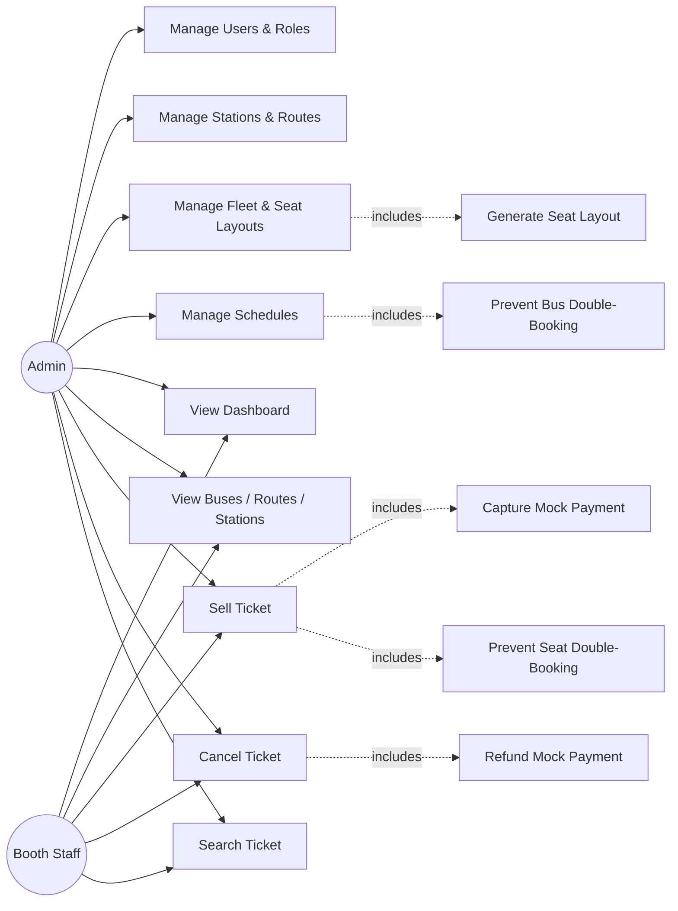
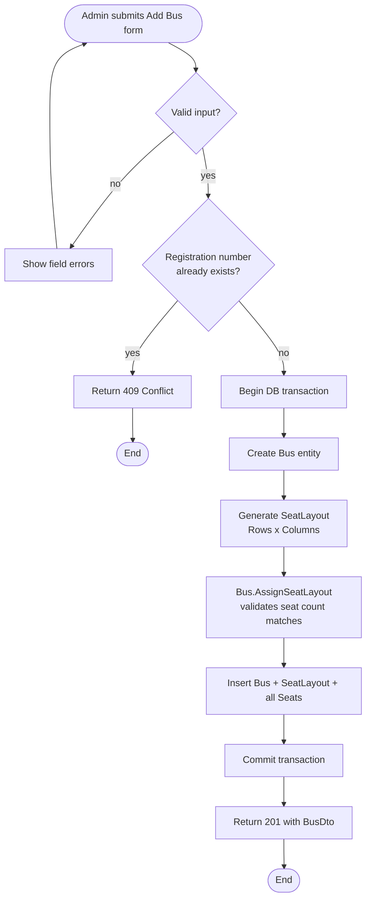

# Roadmap

## Phase 1: Foundation + Fleet Operations — ✅ delivered

Auth, Users, Roles, Stations, Routes, Buses, Seat Layouts, Schedules — fully
implemented backend-to-frontend, with tests.

## Phase 2: Booking, Mock Payment, Real Dashboard — ✅ delivered

Ticket sell/cancel/search, mock payment capture, double-booking prevention
(application pre-check + DB unique-index backstop), and a Dashboard driven by real
sold/available/revenue data. See [FEATURES.md](FEATURES.md) for the line-by-line
checklist and `git log` for the exact commits.

## Use case diagram — current scope (Phase 1 + 2)

## Activity diagram — creating a bus (illustrates the transactional seat-layout generation)

## Phase 3: Client-facing portal — ✅ delivered

Separate Angular client portal for public trip search and booking, running
parallel to the admin console. See `frontend/bus-ticketing-client/` for the
full implementation.

### Hardening
- Rate limiting on `/auth/login` (SECURITY.md).
- Fine-grained permission claims per role, not just role-name checks.
- Per-provider migrations actually generated and tested against SQL
  Server/MySQL/Oracle, not just PostgreSQL (DATABASE.md documents the process;
  it hasn't been exercised against all four engines).
- Ticket-number generation moved from a COUNT-based query to a DB sequence per
  date, closing the narrow race condition documented in `SellTicket.cs`.
- Standard security headers (HSTS, X-Content-Type-Options, etc.) explicitly configured.
